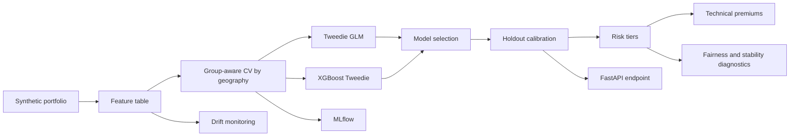

# ML Underwriting Engine

An end-to-end, public-safe ML underwriting and risk decision engine built on synthetic data. It demonstrates senior data science work beyond a notebook: realistic data generation, exposure-weighted modeling, group-aware validation, calibration, decisioning, diagnostics, monitoring, MLflow tracking, an inference API, tests, Docker, and CI.

## Architecture



## What This Shows

- Public-safe synthetic portfolio generation with property, applicant, geography, economic, and exposure variables.
- Expected-loss target generated from a compound frequency/severity process.
- Tweedie GLM versus XGBoost Tweedie comparison.
- Exposure weighting and geography-grouped cross-validation.
- Holdout calibration with isotonic regression.
- Conversion of predicted expected loss into risk tiers and technical premiums.
- SHAP-first global explanations with a robust fallback when SHAP is unavailable.
- Fairness, tier stability, drift, and performance monitoring reports.
- MLflow experiment tracking.
- FastAPI inference endpoint, Docker image, tests, and GitHub Actions CI.

## Quick Start

```bash
python -m venv .venv
.venv\Scripts\activate  # Windows
pip install -r requirements.txt
underwriting-engine all
```

On macOS/Linux:

```bash
python -m venv .venv
source .venv/bin/activate
pip install -r requirements.txt
underwriting-engine all
```

Artifacts are written to:

- `data/processed/train.csv`
- `data/processed/holdout.csv`
- `models/risk_model.joblib`
- `models/calibrator.joblib`
- `reports/cv_metrics.csv`
- `reports/scored_holdout.csv`
- `reports/fairness_report.csv`
- `reports/stability_report.csv`
- `reports/drift_report.csv`
- `reports/global_explanations.csv`

## Run the API

After training:

```bash
uvicorn underwriting_engine.api:app --reload
```

Example request:

```bash
curl -X POST http://127.0.0.1:8000/predict ^
  -H "Content-Type: application/json" ^
  -d "{\"property_value\":325000,\"building_age\":28,\"square_feet\":1600,\"prior_claims\":1,\"credit_score\":705,\"income_to_rent\":3.2,\"local_unemployment\":0.045,\"median_income\":76000,\"crime_index\":42,\"catastrophe_risk\":0.22,\"rent_growth\":0.035,\"inflation\":0.032,\"deductible\":1000,\"coverage_limit\":260000,\"property_type\":\"single_family\",\"occupancy_type\":\"owner\",\"applicant_segment\":\"standard\",\"region\":\"Midwest\",\"exposure_years\":1.0}"
```

## Docker

```bash
docker build -t ml-underwriting-engine .
docker run --rm -p 8000:8000 -v %cd%/models:/app/models:ro ml-underwriting-engine
```

Train locally before running the container so `models/` exists.

## MLflow

```bash
mlflow ui
```

Then open `http://127.0.0.1:5000` and inspect the `ml-underwriting-engine` experiment.

## Why The Statistically Best Model May Not Be The Best Production Model

The lowest cross-validation deviance is not automatically the best underwriting model. In production, a model also has to be calibrated, stable across geography and time, explainable to reviewers, robust to drift, and operationally maintainable. A boosted tree may win on deviance but produce sharp local jumps in premium, unstable tier assignments, or explanations that are harder to defend. A Tweedie GLM may leave accuracy on the table but offer smoother monotonic behavior, simpler governance, faster retraining, and clearer sensitivity to exposure and rating variables.

This repository makes that tradeoff visible. It logs cross-validation metrics, calibrates the selected model on a geography holdout, creates tier-level stability reports, emits fairness diagnostics by segment and region, and computes PSI drift metrics. The decision layer is deliberately separate from the model so the organization can tune risk appetite, minimum premium, expense load, and review thresholds without retraining the estimator.

## Project Structure

```text
configs/                  Reproducible pipeline configuration
docs/                     Architecture notes and model card
notebooks/                Notebook placeholders with command-first guidance
src/underwriting_engine/  Package code
tests/                    Unit and smoke tests
.github/workflows/        CI
Dockerfile                API container
Makefile                  Common commands
```

## Test

```bash
pytest
ruff check src tests
```

## Notes

This is a synthetic portfolio project for GitHub demonstration. It does not use employer data, customer data, or real underwriting outcomes.
