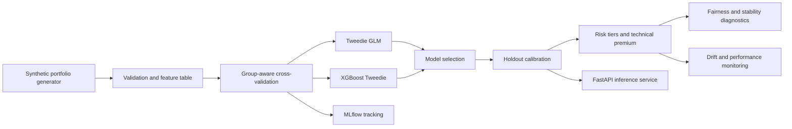

# Architecture

The project intentionally separates statistical modeling from decisioning. The
model predicts expected loss; pricing and underwriting tiers are a governed
decision layer that can be reviewed, constrained, and monitored independently.
